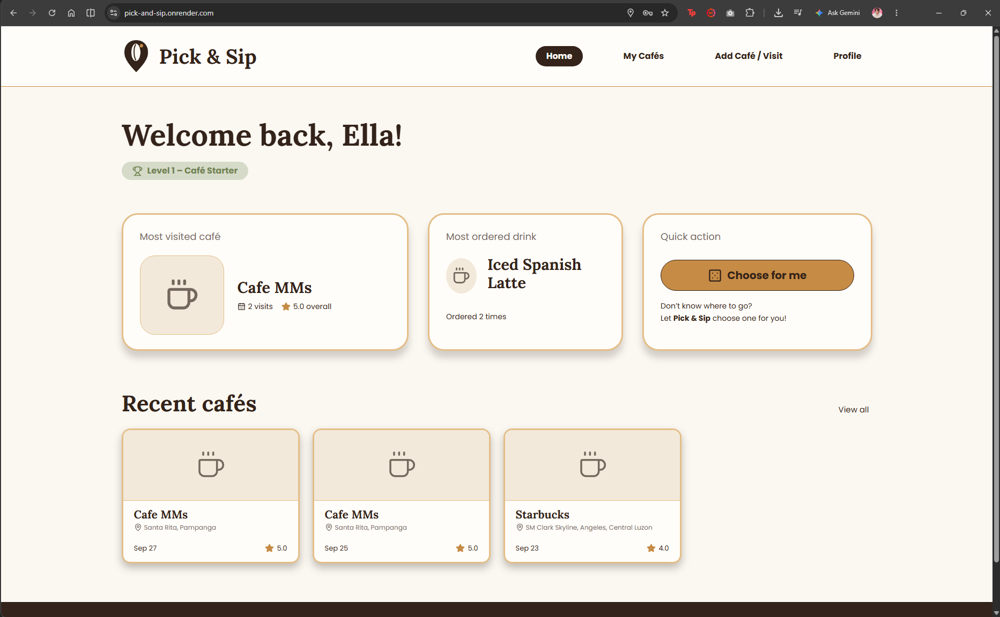

# Pick & Sip

> **Pick your place. Sip your way.**

Pick & Sip is a personal café-tracking web application designed to help me keep track of the cafés I visit, my orders and experiences, and where I might want to go next.

**Live site:** https://pick-and-sip.onrender.com

**API:** https://pick-and-sip-api.onrender.com/health

**Demo video:** 

**Main Screen**


## What it does

- View a dashboard with a summary of café activity, including the most visited café, most ordered drink, recent cafés, and café explorer level
- Browse saved cafés through the My Cafés page
- Search for and add new cafés with location information
- Record café visits, including visit dates, notes, orders, prices, and ratings
- View detailed information and visit history for each café
- Add, edit, and delete café and visit notes
- Filter cafés by rating, price range, and tags
- Use **Choose for Me** to randomly select a café based on selected preferences
- View café locations using an interactive map
- Edit the user's profile username
- Automatically calculate the user's Café Explorer level based on the number of distinct cafés visited

## Built with

- **React** and **Vite** for the front end
- **Express** and **Node.js** for the back end
- **PostgreSQL** for the database
- **Supabase** for hosted PostgreSQL
- **Render** for deployment
- **Leaflet** and **OpenStreetMap/Photon** for café location and map features
- **React Router** for page navigation
- **Lucide React** for interface icons

The client is deployed on Render as a Static Site, the Express API is deployed on Render as a Web Service, and the PostgreSQL database is hosted on Supabase.

## Running it yourself

To run Pick & Sip locally, you need Node.js and a PostgreSQL database.

### 1. Clone the repository

```bash
git clone YOUR_GITHUB_REPOSITORY_URL
cd PickAndSip
```

### 2. Set up the backend

Create a file named `server/.env`:

```env
DATABASE_URL=your_postgresql_connection_string
CORS_ORIGINS=http://localhost:5173
NODE_ENV=development
```

Then open a terminal in the project folder and run:

```bash
cd server
npm install
npm run dev
```

The backend will run at:

```text
http://localhost:3000
```

### 3. Set up the frontend

Open a **second terminal** and run:

```bash
cd client
npm install
npm run dev
```

Create a file named `client/.env`:

```env
VITE_USE_MOCK_API=false
VITE_API_BASE_URL=http://localhost:3000
```

The frontend will run at:

```text
http://localhost:5173
```

### 4. Database

The database schema is provided in:

```text
server/db/schema.sql
```

The application uses PostgreSQL. The deployed version uses Supabase PostgreSQL.

The `seed.sql` file contains sample data for development and testing, but it is not required for the deployed version.

## Environment variables

Environment files containing passwords and database credentials are not committed to the repository.

### Server environment variables

| Name | Where | What it is |
| --- | --- | --- |
| `DATABASE_URL` | server | PostgreSQL/Supabase connection string. Contains a password |
| `CORS_ORIGINS` | server | Frontend URL(s) allowed to access the API |
| `NODE_ENV` | server | `development` locally and `production` on Render |
| `PORT` | server | Port provided by the hosting platform |

Example local server configuration:

```env
DATABASE_URL=your_postgresql_connection_string
CORS_ORIGINS=http://localhost:5173
NODE_ENV=development
```

### Client environment variables

| Name | Where | What it is |
| --- | --- | --- |
| `VITE_USE_MOCK_API` | client, at build time | `false` to use the Express API |
| `VITE_API_BASE_URL` | client, at build time | Public URL of the Express API |

Example local client configuration:

```env
VITE_USE_MOCK_API=false
VITE_API_BASE_URL=http://localhost:3000
```

For the deployed frontend:

```env
VITE_USE_MOCK_API=false
VITE_API_BASE_URL=https://pick-and-sip-api.onrender.com
```

Every `VITE_` value is compiled into the built JavaScript and is therefore public.

Never put a password, database connection string, private key, or other secret in a `VITE_` variable.

## Checking the API

The backend provides a health endpoint:

```text
http://localhost:3000/health
```

The deployed API health endpoint is:

```text
https://pick-and-sip-api.onrender.com/health
```

A successful response should look like:

```json
{
  "ok": true,
  "db": "up"
}
```

This confirms that the Express server is running and can connect to the PostgreSQL database.

## Deploying

Pick & Sip is deployed using Render for both the frontend and backend, with Supabase providing the PostgreSQL database.

### Client — Render Static Site

The React frontend is deployed as a Render Static Site.

**Root Directory:**

```text
client
```

**Build Command:**

```bash
npm install && npm run build
```

**Publish Directory:**

```text
dist
```

The frontend uses the following Render environment variables:

```env
VITE_USE_MOCK_API=false
VITE_API_BASE_URL=https://pick-and-sip-api.onrender.com
```

Because Pick & Sip uses React Router, the Render Static Site uses the following rewrite:

| Source | Destination | Action |
| --- | --- | --- |
| `/*` | `/index.html` | Rewrite |

This allows routes such as `/cafes`, `/cafes/:id`, `/add`, and `/profile` to work when accessed directly or refreshed.

### API — Render Web Service

The Express backend is deployed as a Render Web Service.

**Root Directory:**

```text
server
```

**Build Command:**

```bash
npm install
```

**Start Command:**

```bash
npm start
```

The start command runs:

```bash
node server.js
```

The backend uses the following Render environment variables:

```env
DATABASE_URL=your_supabase_connection_string
NODE_ENV=production
CORS_ORIGINS=https://pick-and-sip.onrender.com
```

The server uses the port provided by Render.

### Database — Supabase

The PostgreSQL database is hosted on Supabase.

The main database tables are:

```text
profiles
cafes
visits
orders
```

The database schema is located at:

```text
server/db/schema.sql
```

The Express backend communicates with Supabase PostgreSQL. The React frontend does not directly connect to the database.

## Project structure

```text
PickAndSip/
│
├── client/                     React/Vite frontend
│   ├── src/
│   │   ├── api/
│   │   ├── components/
│   │   ├── pages/
│   │   └── ...
│   ├── package.json
│   └── ...
│
├── server/                     Express API and database access logic.
│   ├── db/                     PostgreSQL schema and other database-related files.
│   │   ├── schema.sql
│   │   ├── seed.sql
│   │   └── ...
│   ├── cafesRepo.js
│   ├── profileRepo.js
│   ├── server.js
│   ├── package.json
│   └── ...
│
├── docs/
│
├── README.md
├── AI-USAGE.md
└── LICENSE
```

## Architecture

Three or four sentences, or a small diagram. Which piece talks to which, and
where each one is hosted.

## What I would do next

- Improve the café search and location experience with more detailed location information.
- Conduct additional usability testing with students and café-goers.
- Add more features based on feedback from actual users.

## Author

**Francine Angela G. Alejandro**

CS-402

## AI use


I used AI to assist with:

- Understanding how to start the frontend development
- Setting up React Router
- Developing and refining the frontend UI
- Implementing map and location functionality
- Debugging frontend and backend issues
- Understanding API and database integration
- Troubleshooting deployment and configuration issues
- Improving CSS and responsive behavior

AI-generated suggestions were reviewed, tested, and modified during development. The final implementation and design decisions were made by me.

One example where AI initially got something wrong was the map implementation. I intended to use Leaflet and OpenStreetMap, but an AI suggestion initially used Google Maps. I corrected the implementation to use the intended Leaflet/OpenStreetMap approach.

Another example was the hamburger menu behavior. The initial AI-generated implementation did not match the intended mobile design, so I reviewed and adjusted the behavior and styling to match the project's requirements.

For the complete record of AI assistance, see [AI-USAGE.md](AI-USAGE.md).

## Licence

MIT, see [LICENSE](LICENSE).
