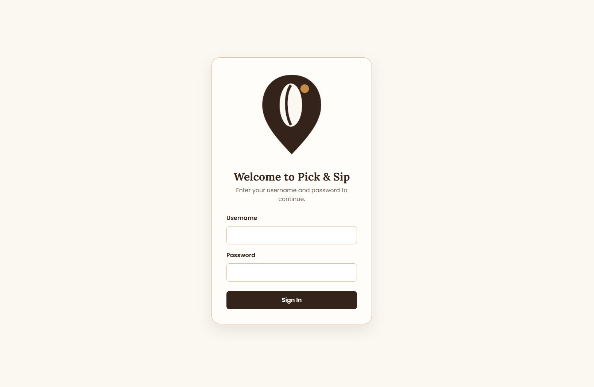
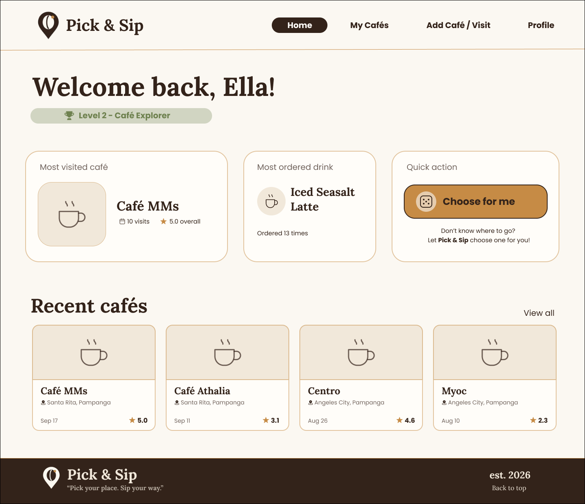
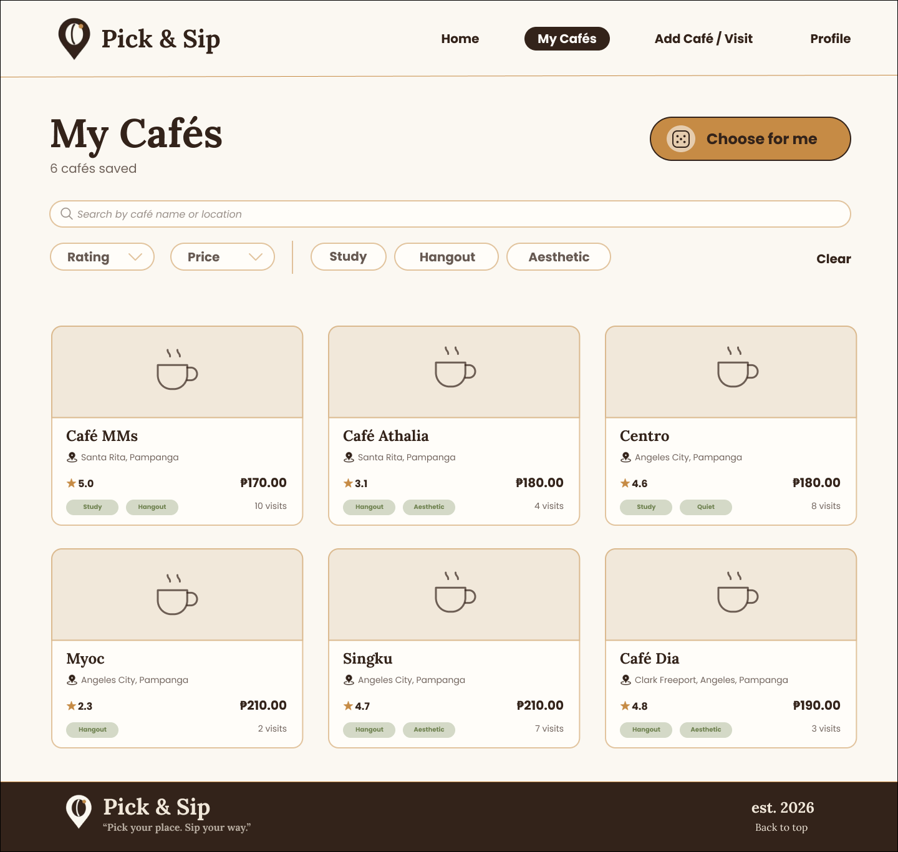
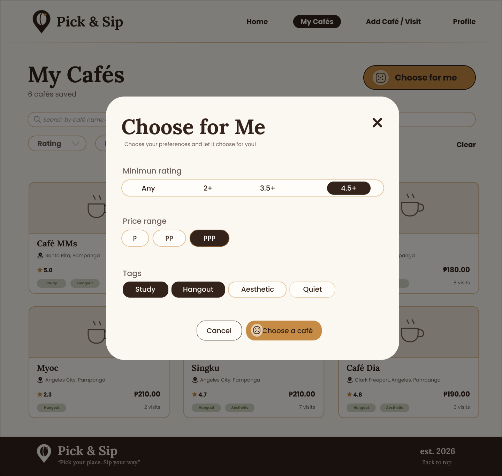
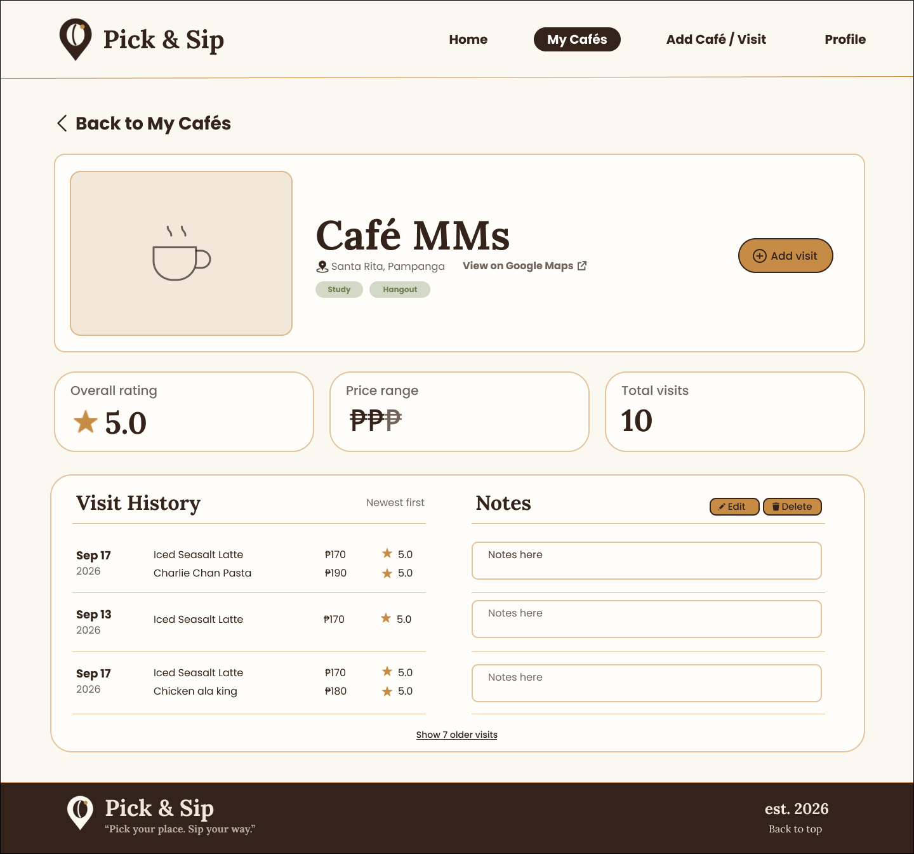
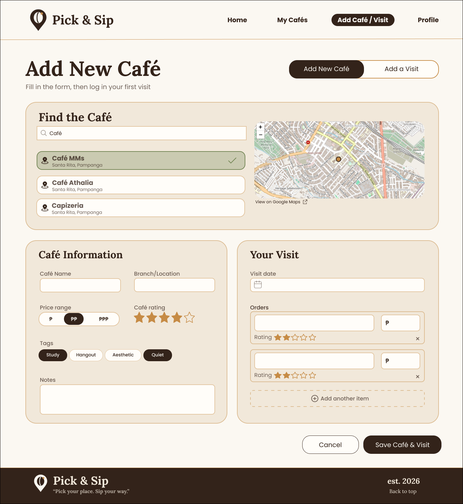
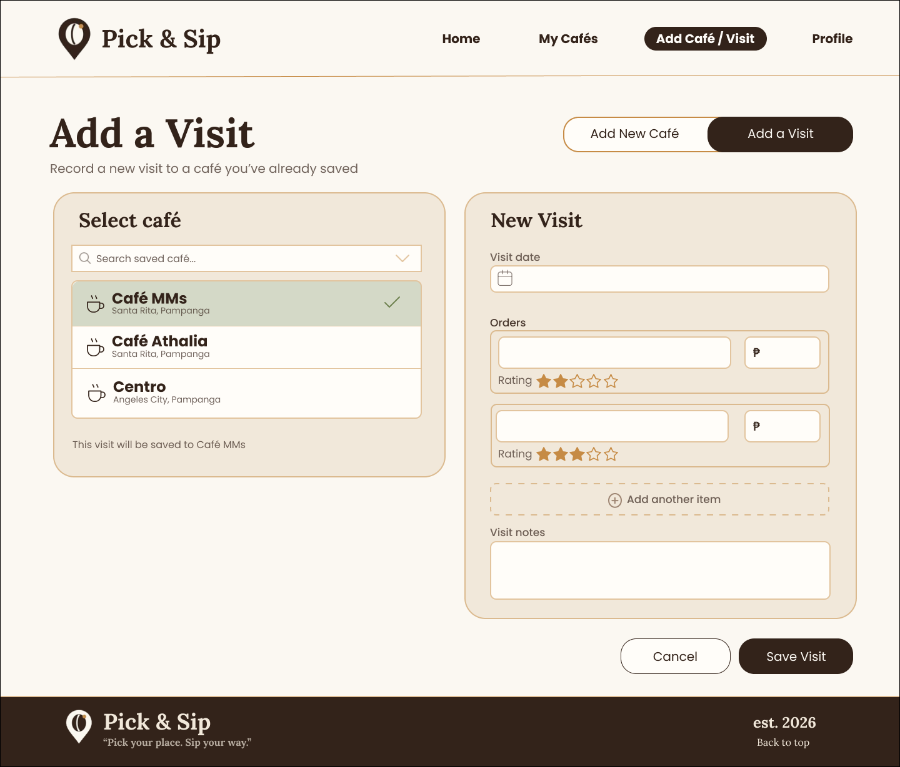
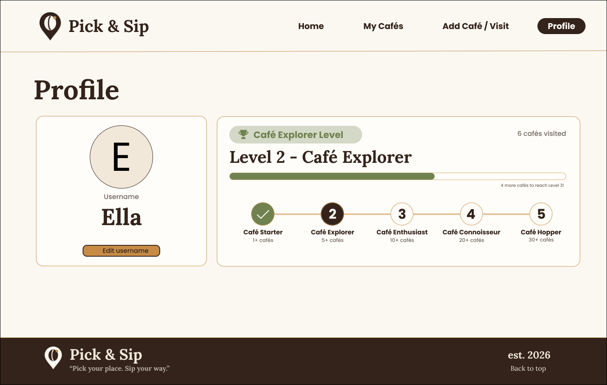
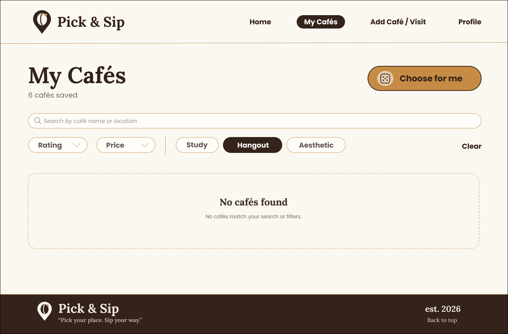
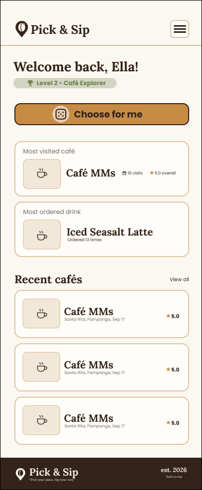

# Mockup

The final mockup represents the final visual design of Pick & Sip, including the actual colours, typography, spacing, content, café cards, buttons, forms, maps, and responsive layouts.

The mockup covers all screens included in the revised proposal:

- Dashboard / Home
- My Cafés
- Add Café
- Profile
- Café Details

It also includes the mobile layout and an empty state for when there are no saved cafés or no café data to display.

## Screens

### Login

Shows the application login screen used to access the Pick & Sip application.

### Dashboard / Home

The home page shows an overview of café activity, including the cafe explorer level, most visited café, most ordered drink, recent cafés, and quick actions.

### My Cafes

The My Cafes page shows the saved café list, including the search bar, filters, café cards, and the "Choose for Me" feature. The "Choose for Me" popup is included within this screen rather than being a separate route.

**Choose for me popup**

The popup allows the user to set preferences such as minimum rating and price range before selecting a café from the saved café list.

### Cafe Details

The Cafe Details page shows the selected café's information, including its location, price range, rating, tags, notes, and visit and order history. It also provides the option to add a visit and manage notes.

### Add Cafe

The Add Café screen provides the forms needed to add a new café or record a visit to an existing café.

**Add New Cafe**

Shows the form for adding a new café, including café information, location, price range, rating, tags, notes, and the first visit and orders.

**Add a Visit**

Shows the form for selecting an existing café and recording a new visit with its date, notes, and orders.

### Profile

The Profile shows the user's username, Café Explorer level, and progress toward the next level.

### Empty State

This shows how the application appears when there are no saved cafés or when no cafés match the current search or filters.

### Mobile Layout

## Honest note

The deployed application has a few minor visual differences from the mockup:

- The **Choose for Me** text is centered in the desktop mockup but is left-aligned in the deployed desktop application.
- In the mobile mockup, **Choose for Me** appears above the recent cafés without its own card, while in the deployed mobile application it remains inside its card and is placed below the **Most ordered drink** section.

These are minor visual differences and do not affect the functionality or overall layout of the application.