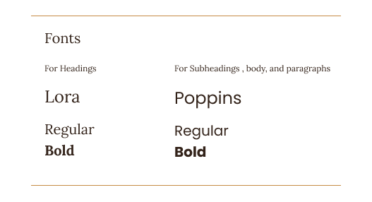

# Design system

The Pick & Sip design system defines the visual rules used throughout the application so that the screens maintain a consistent visual style.

The complete **visual Design System is submitted as a PDF**. It contains the visual color tokens, contrast checks, typography scale, spacing rules, reusable component list, responsive layout plan, and accessibility checks. The visual examples and images are also included there.

The component and application states documented below are based on the current Pick & Sip implementation in the submitted project code.

[View the Design System PDF](assets/System-Design.pdf)

## What to record

### Color

Pick & Sip uses the following color tokens:

| Code name | Hex value | Usage |
|---|---|---|
| `--color-primary` | `#33231A` | Buttons, links, active navigation, focus ring, body text, and headings |
| `--color-accent` | `#C68B45` | Choose for Me action, star icons, and highlights |
| `--color-accent2` | `#6F8250` | Tags, progress bar, and Café Explorer level badge |
| `--color-bg` | `#FBF8F2` | Page background |
| `--color-surface` | `#FFFDF9` | Cards, panels, inputs, and popup |

The following text and background combinations meet the required contrast ratio:

| Text | Background | Contrast ratio | Result |
|---|---|---:|---|
| `--color-primary` | `--color-accent` | 5.14:1 | Pass |
| `--color-primary` | `--color-bg` | 14.19:1 | Pass |
| `--color-primary` | `--color-surface` | 14.8:1 | Pass |

### Type

The design system uses the following type scale:

| Style | Size | Weight | Used for |
|---|---:|---|---|
| Heading | 28px | Bold | Screen and section titles |
| Body | 16px | Regular / Bold | Paragraphs, lists, inputs, buttons, café details, and card/section titles |
| Small | 13px | Regular | Captions, labels, tags, chips, and footer |

The font family used by the interface is **Lora for headings and Poppins for subheadings and body/interface text**.


### Spacing

The design system uses the following spacing and sizing rules:

| Rule | Value |
|---|---|
| Screen edge padding | 16px on mobile |
| Screen edge padding | 32px on desktop |
| Inputs and images | 8px radius |
| Cards and popup | 16px radius |
| Buttons, chips, and tags | Pill-shaped |

### Components

The design system defines the following reusable components:

| Component | Level | Appears on |
|---|---|---|
| Button | Atom | Everywhere |
| Chip / Tag | Atom | My Cafés, Add Café / Visit, Café Details, Choose for Me |
| StarRating | Atom | Café Card, Café Details, Add Café / Visit, Choose for Me |
| ProgressBar | Atom | Home, Profile |
| NavLink | Atom | NavBar |
| SearchBar | Molecule | My Cafés |
| CafeCard | Molecule | Home, My Cafés, Choose for Me result |
| LevelBadge | Molecule | Home, Profile |
| FormField | Molecule | Add Café / Visit, Profile |
| NavBar | Organism | Every screen |
| Footer | Organism | Every screen |
| ChooseForMeModal | Organism | My Cafés |

The reusable components also have the props defined in the design system.

### Component states

The current implementation includes the following component-specific loading and disabled states.

**Add Café / Add Visit**

```text
Saving...
```

The save button is disabled while the save operation is in progress.

**Login**

```text
Signing in...
```

The sign-in button is disabled while login is being processed.

**Choose for Me**

```text
Choosing...
```

The Choose for Me button is disabled while a café is being selected.

The application also uses visible error messages when requests or actions fail. These messages are generated from the returned error and therefore do not use one fixed message in the interface.

### Application states

The current implementation includes loading, empty, error, and data states.

**Loading**

Dashboard:

```text
Loading your cafés...
```

My Cafés:

```text
Loading cafés...
```

Café Details:

```text
Loading café...
```

Profile:

```text
Loading profile...
```

**Empty**

When there are no cafés matching the current search or filters, My Cafés shows:

```text
No cafés found
No cafés match your search or filters.
```

The Dashboard also displays data-specific empty messages when applicable:

```text
No cafés yet
```

and:

```text
No orders yet
```

**Error**

The current pages display the returned error message when loading or saving data fails. The error text is dynamic rather than a single fixed message.

**Data**

When the requested data is successfully loaded, the normal page content is displayed, including café cards, café details, profile information, visits, orders, and dashboard statistics.

### Responsive design

The design system uses the following responsive plan:

#### Mobile

Below **768px**:

- Navigation collapses into a hamburger menu.
- Cards and forms stack into one column.
- Filter chips wrap as needed.

#### Desktop

At **768px and above**:

- Navigation displays Home / My Cafés inline with the avatar.
- The café grid uses two or more columns.
- Forms can use two columns.

### Accessibility

The design system includes the following accessibility checks:

- Text has enough contrast against the background.
- Accent colors are not used as the only way to communicate information.
- Semantic HTML elements such as `header`, `nav`, `main`, `footer`, `button`,
  and `a` are used appropriately.
- Meaningful images have alt text.
- Decorative icons do not require alt text.
- Every form input has a matching label.
- Font sizes are clear and readable.
- Buttons use clear labels such as "Save Visit," "Add Visit," and "Choose for Me."
- Important information is not communicated through color alone.
- The application remains usable on smaller screens without horizontal
  scrolling.

## In code

Pick & Sip uses **plain CSS / CSS Modules with CSS custom properties** for its reusable design tokens.

The CSS files in the project contain the styling and reusable design values.